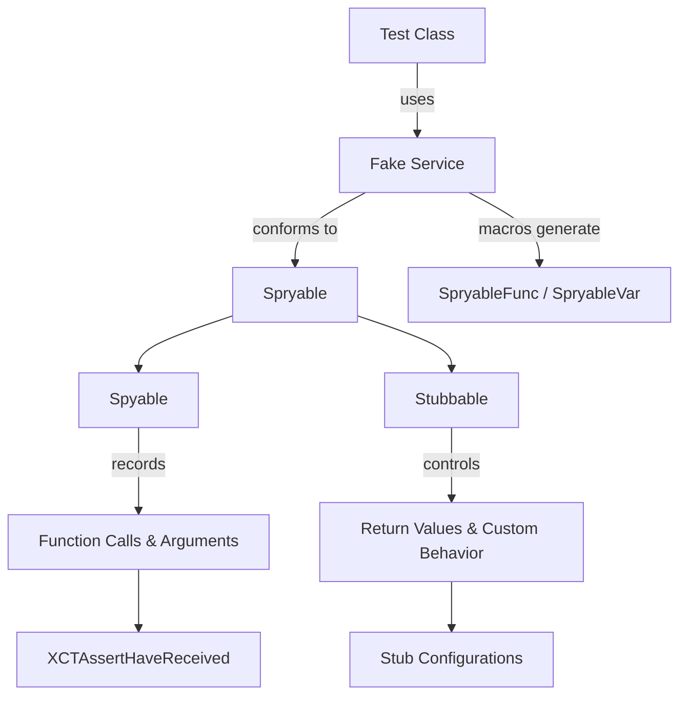
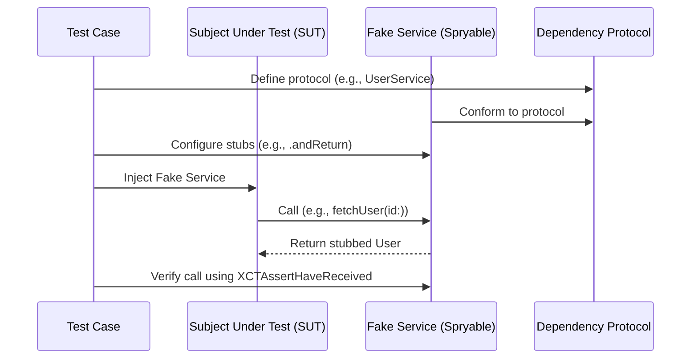

# SpryKit

[](https://swiftpackageindex.com/NikSativa/SpryKit)
[](https://swiftpackageindex.com/NikSativa/SpryKit)
[](https://github.com/NikSativa/SpryKit/actions/workflows/swift_macos.yml)
[](https://opensource.org/licenses/MIT)

SpryKit is a powerful Swift testing framework that provides spying and stubbing capabilities, making it easier to write clean and maintainable unit tests. It's designed to help you test classes in isolation by verifying method calls and controlling return values.

> [!IMPORTANT]
> Thread-safe: perfect for multi-threaded test environments.

## Best Practices

1. **Prefer Macros (Swift 6.0+)**  
   Use macros whenever possible—they reduce boilerplate, eliminate implementation errors, and keep test doubles concise.

2. **Reset Test Doubles Between Tests**  
   Always call `resetCallsAndStubs()` in `tearDown()` to ensure each test starts from a clean state.

3. **Use Argument Captors for Detailed Validation**  
   When argument values are complex or dynamic, `ArgumentCaptor` allows you to assert their content precisely.

4. **Take Advantage of Rich Assertion Messages**  
   SpryKit’s assertions provide detailed output on failure, making tests easier to debug and maintain.

5. **Stub Error Cases Intentionally**  
   Ensure you test both success and failure scenarios by stubbing functions to throw errors or return unexpected values.

6. **Fake naming convention**  
   `Fake` classes (named with the `Fake` prefix, e.g., `FakeUserService`) should be used for all test doubles—both manual and macro-generated—in your tests. This naming convention makes their purpose obvious and keeps your tests clear.

## Motivation

When writing unit tests, it's considered best practice to isolate and test the behavior of a single class—referred to as the Subject Under Test (SUT). Swift makes this difficult when you need to verify interactions with dependencies, such as whether methods are called, what arguments they receive, and what values they return.

**SpryKit** addresses this challenge by allowing you to create spy objects that record function calls and arguments, and stub objects that return specific values or perform custom behavior. This makes it possible to write focused, deterministic tests that verify the behavior of the SUT in isolation.

## Why SpryKit?

Traditional mocking and stubbing in Swift can be verbose and error-prone, especially when verifying method calls and handling dynamic return values. **SpryKit** streamlines this process with a unified API that:

- Minimizes boilerplate through macro generation
- Provides expressive, readable test assertions
- Ensures thread safety and stability for concurrent tests
- Offers fine-grained argument control with validation and capturing

## Features

- 🎯 **Spying**: Record and verify method calls and their arguments
- 🎭 **Stubbing**: Control method return values for testing different scenarios
- 🚀 **Macro Support**: Reduce boilerplate with Swift 6.0+ macros
- 🔒 **Thread Safety**: Built-in support for multi-threaded environments
- 📱 **Cross-Platform**: Support for iOS, macOS, tvOS, watchOS, and visionOS
- 🧪 **Rich Assertions**: Comprehensive set of XCTest and Swift Testing assertions
- 🔍 **Argument Capturing**: Capture and inspect method arguments
- 🎨 **Image Testing**: Built-in support for image comparison testing
- 📊 **Diff API**: Powerful diff functionality for comparing strings, objects, and structures

__Table of Contents__

### 📘 Overview
* [Best Practices](#best-practices)
* [Motivation](#motivation)
* [Why SpryKit](#why-sprykit)
* [Features](#features)
* [Installation](#installation)
* [Quick Start](#quick-start)

### 🛠️ Core Concepts
* [Spying](#spying)
* [Stubbing](#stubbing)
* [Argument Capturing](#argument-capturing)
* [Spryable](#spryable)
  * [Spryable + Macro](#spryable--macro)
  * [Spryable + manually](#spryable--manually)
* [Stubbable](#stubbable)
* [Spyable](#spyable)
* [XCTAsserts](#xctasserts)
* [SpryEquatable](#spryequatable)
* [Argument](#argument)
* [ArgumentCaptor](#argumentcaptor)
* [MacroAvailable](#macroavailable)

### 🧪 Advanced Testing
* [XCTAssertHaveReceived / XCTAssertHaveNotReceived](#xctasserthavereceived--xctasserthavenotreceived)
* [XCTAssertEqualAny / XCTAssertNotEqualAny](#xctassertequalany--xctassertnotequalany)
* [XCTAssertThrowsAssertion](#xctassertthrowsassertion)
* [XCTAssertThrowsError / XCTAssertNoThrowError](#xctassertthrowserror--xctassertnothrowerror)
* [XCTAssertEqualError / XCTAssertNotEqualError](#xctassertequalerror--xctassertnotequalerror)
* [XCTAssertEqualImage / XCTAssertNotEqualImage](#xctassertequalimage--xctassertnotequalimage)
* [Diff API](#diff-api)

### 🆕 Swift Testing Support
* [Swift Testing Overview](#swift-testing-overview)
* [expectHaveReceived / expectHaveNotReceived](#expecthavereceived--expecthavenotreceived)
* [expectEqualAny / expectNotEqualAny](#expectequalany--expectnotequalany)
* [expectThrowsAssertion](#expectthrowsassertion)
* [expectThrows / expectNoThrow](#expectthrows--expectnothrow)
* [expectEqualError / expectNotEqualError](#expectequalerror--expectnotequalerror)
* [expectEqualImage / expectNotEqualImage](#expectequalimage--expectnotequalimage)
* [Diff API (Swift Testing)](#diff-api-swift-testing)

### 🎨 Visuals
* [Visual Overview](#visual-overview)
* [How It Works in Tests](#how-it-works-in-tests)

### 📚 Meta
* [Requirements](#requirements)
* [Contributing](#contributing)
* [License](#license)

## Installation

### Swift Package Manager

Add the following to your `Package.swift`:

```swift
dependencies: [
    .package(url: "https://github.com/NikSativa/SpryKit.git", from: "1.0.0")
]
```

## Quick Start

### 1. Create a Protocol or Class to Test

```swift
protocol UserService {
    func fetchUser(id: String) -> User
    var currentUser: User? { get set }
}
```

### 2. Create a Fake Implementation

#### Using Swift 6.0+ Macros (Recommended)

> [!NOTE]
> Macros reduce boilerplate by generating protocol conformance and necessary stubbing/spying code for you. All you need to do is annotate your class or properties/functions.

```swift
@Spryable
final class FakeUserService: UserService {
    @SpryableVar
    var currentUser: User?
    
    @SpryableFunc
    func fetchUser(id: String) -> User
}
```

#### Manual Implementation

If you're unable to use macros (e.g., due to Swift version constraints), you can implement `Spryable` manually as shown:

```swift
final class FakeUserService: UserService, Spryable {
    enum ClassFunction: String, StringRepresentable {
        case none
    }
    
    enum Function: String, StringRepresentable {
        case currentUser
        case fetchUser = "fetchUser(id:)"
    }
    
    var currentUser: User? {
        get { return stubbedValue() }
        set { recordCall(arguments: newValue) }
    }
    
    func fetchUser(id: String) -> User {
        return spryify(arguments: id)
    }
}
```

### 3. Write Tests

#### Using XCTest

```swift
class UserViewModelTests: XCTestCase {
    var sut: UserViewModel!
    var fakeUserService: FakeUserService!
    
    override func setUp() {
        super.setUp()
        fakeUserService = FakeUserService()
        sut = UserViewModel(userService: fakeUserService)
    }
    
    override func tearDown() {
        fakeUserService.resetCallsAndStubs()
        super.tearDown()
    }
    
    func test_fetchUser_success() {
        // Given
        let expectedUser = User(id: "1", name: "John")
        fakeUserService.stub(.fetchUser).with("1").andReturn(expectedUser)
        
        // When
        sut.fetchUser(id: "1")
        
        // Then
        XCTAssertHaveReceived(fakeUserService, .fetchUser)
        XCTAssertEqual(sut.currentUser, expectedUser)
    }
}
```

#### Using Swift Testing (Swift 5.9+)

> [!NOTE]
> SpryKit fully supports Apple's Swift Testing framework. Use `expectHaveReceived`, `expectEqualAny`, and other Swift Testing assertions instead of XCTest assertions.

```swift
import Testing

@Suite("UserViewModel Tests", .serialized)
final class UserViewModelTests {
    @Test("Fetch user success")
    func test_fetchUser_success() {
        let fakeUserService = FakeUserService()
        let sut = UserViewModel(userService: fakeUserService)
        
        // Given
        let expectedUser = User(id: "1", name: "John")
        fakeUserService.stub(.fetchUser).with("1").andReturn(expectedUser)
        
        // When
        sut.fetchUser(id: "1")
        
        // Then
        expectHaveReceived(fakeUserService, .fetchUser)
        #expect(sut.currentUser == expectedUser)
    }
}
```

## Core Concepts

### Spying

Spying allows you to verify that methods were called with the correct arguments:

#### Using XCTest

```swift
// Verify a method was called
XCTAssertHaveReceived(fakeService, .doSomething)

// Verify with specific arguments
XCTAssertHaveReceived(fakeService, .doSomething, with: "expected argument")

// Verify call count
XCTAssertHaveReceived(fakeService, .doSomething, countSpecifier: .exactly(2))
```

#### Using Swift Testing

```swift
// Verify a method was called
fakeService.method()
expectHaveReceived(fakeService, .method)

// Verify with specific arguments
fakeService.stub(.doSomethingWith).andReturn("value")
_ = fakeService.doSomething(with: "expected argument")
expectHaveReceived(fakeService, .doSomethingWith, with: "expected argument")

// Verify call count
fakeService.method()
fakeService.method()
expectHaveReceived(fakeService, .method, countSpecifier: .exactly(2))
```

### Stubbing

Stubbing lets you control what methods return:

```swift
// Simple return value
fakeService.stub(.doSomething).andReturn("test value")
let result = fakeService.doSomething()
#expect(result == "test value")

// Conditional return based on arguments
fakeService.stub(.doSomethingWith)
    .with("specific arg")
    .andReturn("special value")
let result2 = fakeService.doSomething(with: "specific arg")
#expect(result2 == "special value")

// Custom implementation
fakeService.stub(.doSomethingWith).andDo { arguments in
    let arg = arguments[0] as! String
    return arg.uppercased()
}
let result3 = fakeService.doSomething(with: "test")
#expect(result3 == "TEST")
```

### Argument Capturing

Capture and inspect arguments passed to methods:

```swift
let captor = Argument.captor()
fakeService.stub(.doSomethingWith).with(captor).andReturn("value")

_ = fakeService.doSomething(with: "expected value")

// Later in the test
let capturedArg = captor.getValue(as: String.self)
#expect(capturedArg == "expected value")
```

## Advanced Features

### Custom Argument Validation

```swift
let customValidation = Argument.validator { actualArgument -> Bool in
    guard let string = actualArgument as? String else { return false }
    return string.hasPrefix("test")
}

fakeService.stub(.doSomethingWith)
    .with(customValidation)
    .andReturn("validated")

let result = fakeService.doSomething(with: "test123")
#expect(result == "validated")
```

### Testing Errors

```swift
// Test throwing functions
XCTAssertThrowsError(try sut.riskyOperation())

// Test specific errors
XCTAssertEqualError(try sut.riskyOperation(), expectedError)
```

### Image Testing

```swift
XCTAssertEqualImage(actualImage, expectedImage)
```

## Spryable

Conform to both Stubbable and Spyable at the same time! For information about [Stubbable](#stubbable) and [Spyable](#spyable) see their respective sections below.

__Abilities__

* Conform to `Spyable` and `Stubbable` at the same time.
* Reset calls and stubs at the same time with `resetCallsAndStubs()`
* Easy to implement
    * Create an object that conforms to `Spryable`
    * In every function (the ones that should be stubbed and spied) return the result of `spryify()` passing in all arguments (if any)
        * also works for special functions like `subscript`
    * In every property (the ones that should be stubbed and spied) return the result of `stubbedValue()` in the `get {}` and use `recordCall()` in the `set {}`

Let’s look at an example

```swift
// A real implementation can be a protocol
protocol StringService: AnyObject {
    var readonlyProperty: String { get }
    var readwriteProperty: String { set get }
    func doThings()
    func giveMeAString(arg1: Bool, arg2: String) -> String
    static func giveMeAString(arg1: Bool, arg2: String) -> String
}

// A real implementation can also be a class
class RealStringService: StringService {
    var readonlyProperty: String {
        return ""
    }

    var readwriteProperty: String = ""

    func doThings() {
        // do real things
    }

    func giveMeAString(arg1: Bool, arg2: String) -> String {
        // do real things
        return ""
    }

    class func giveMeAString(arg1: Bool, arg2: String) -> String {
        // do real things
        return ""
    }
}
```

### Spryable + Macro

> [!WARNING]
> **Available only for Swift 6.0 and higher.**

> [!TIP]
> [MacroAvailable](#MacroAvailable) - how to handle breaking API changes.

- *Spryable* macro generates Spryable conformance for a class.
- *SpryableFunc* macro generates body for function with correct name and arguments.
- *SpryableVar* macro generates body for property with correct name and accessors.

```swift
@Spryable
final class FakeStringService: StringService {
    @SpryableVar
    var readonlyProperty: String

    @SpryableVar(.set)
    var readwriteProperty: String

    @SpryableFunc
    func doThings()

    @SpryableFunc
    func giveMeAString(arg1: Bool, arg2: String) -> String

    @SpryableFunc
    static func giveMeAString(arg1: Bool, arg2: String) -> String
}
```

### Spryable + manually

```swift
// The **Fake** Class: Always use the "Fake" prefix to indicate a test double (e.g., `FakeUserService`).
// If the Fake is a subclass, remember that `override` is required for each function and property.
final class FakeUserService: UserService, Spryable {
    enum ClassFunction: String, StringRepresentable {  
        case giveMeAStringWithArg1_Arg2 = "giveMeAString(arg1:arg2:)"
    }
    enum Function: String, StringRepresentable { 
        case readonlyProperty
        case readwriteProperty
        case doThings = "doThings()"
        case giveMeAStringWithArg1_Arg2 = "giveMeAString(arg1:arg2:)"
    }

    var readonlyProperty: String {
        return stubbedValue()
    }

    var readwriteProperty: String {
        set {
            recordCall(arguments: newValue)
        }
        get {
            return stubbedValue()
        }
    }

    func doThings() {
        return spryify() 
    }

    func giveMeAString(arg1: Bool, arg2: String) -> String {
        return spryify(arguments: arg1, arg2) 
    }

    static func giveMeAString(arg1: Bool, arg2: String) -> String {
        return spryify(arguments: arg1, arg2) 
    }
}
```

## Stubbable

_Spryable conforms to Stubbable._

__Abilities__

* Stub a return value for a function on an instance of a class or the class itself using `.andReturn()`
* Stub the implementation for a function on an instance of a class or the class itself using `.andDo()`
    * `.andDo()` takes in a closure that passes in an `Array` containing the parameters and should return the stubbed value
* Specify stubs that only get used if the right arguments are passed in using `.with()` (see [Argument Enum](#argument-enum) for alternate specifications)
* Rich `fatalError()` messages that include a detailed list of all stubbed functions when no stub is found (or the arguments received didn't pass validation)
* Reset stubs with `resetStubs()`

```swift
// will always return `"stubbed value"`
fakeStringService.stub(.hereAreTwoStrings).andReturn("stubbed value")

// defaults to return Void()
fakeStringService.stub(.hereAreTwoStrings).andReturn()

// specifying all arguments (will only return `true` if the arguments passed in match "first string" and "second string")
fakeStringService.stub(.hereAreTwoStrings).with("first string", "second string").andReturn(true)

// using the Argument enum (will only return `true` if the second argument is "only this string matters")
fakeStringService.stub(.hereAreTwoStrings).with(Argument.anything, "only this string matters").andReturn(true)

// using custom validation
let customArgumentValidation = Argument.validator({ actualArgument -> Bool in
    let passesCustomValidation = // ...
    return passesCustomValidation
})
fakeStringService.stub(.hereAreTwoStrings).with(Argument.anything, customArgumentValidation).andReturn("stubbed value")

// using argument captor
let captor = Argument.captor()
fakeStringService.stub(.hereAreTwoStrings).with(Argument.nonNil, captor).andReturn("stubbed value")
captor.getValue(as: String.self) // gets the second argument the first time this function was called where the first argument was also non-nil.
captor.getValue(at: 1, as: String.self) // gets the second argument the second time this function was called where the first argument was also non-nil.

// using `andDo()` - Also has the ability to specify the arguments!
fakeStringService.stub(.iHaveACompletionClosure).with("correct string", Argument.anything).andDo({ arguments in
    // get the passed in argument
    let completionClosure = arguments[0] as! () -> Void

    // use the argument
    completionClosure()

    // return an appropriate value
    return Void() // <-- will be returned by the stub
})

// can stub class functions as well
FakeStringService.stub(.imAClassFunction).andReturn(Void())

// do not forget to reset class stubs (since Class objects are essentially singletons)
FakeStringService.resetStubs()
```

## Spyable

_Spryable conforms to Spyable._

__Abilities__

* Test whether a function was called or a property was set on an instance of a class or the class itself
* Specify the arguments that should have been received along with the call (see [Argument Enum](#argument-enum) for alternate specifications)
* Rich Failure messages that include a detailed list of called functions and arguments
* Reset calls with `resetCalls()`

__The Result__

```swift
// the result
let result = spyable.didCall(.functionName)

// was the function called on the fake?
result.success

// what was called on the fake?
result.recordedCallsDescription
```

__How to Use__

```swift
// passes if the function was called
fake.didCall(.functionName).success

// passes if the function was called a number of times
fake.didCall(.functionName, countSpecifier: .exactly(1)).success

// passes if the function was called at least a number of times
fake.didCall(.functionName, countSpecifier: .atLeast(1)).success

// passes if the function was called at most a number of times
fake.didCall(.functionName, countSpecifier: .atMost(1)).success

// passes if the function was called with equivalent arguments
fake.didCall(.functionName, withArguments: ["firstArg", "secondArg"]).success

// passes if the function was called with arguments that pass the specified options
fake.didCall(.functionName, withArguments: [Argument.nonNil, Argument.anything, "thirdArg"]).success

// passes if the function was called with an argument that passes the custom validation
let customArgumentValidation = Argument.validator({ argument -> Bool in
    let passesCustomValidation = // ...
    return passesCustomValidation
})
fake.didCall(.functionName, withArguments: [customArgumentValidation]).success

// passes if the function was called with equivalent arguments a number of times
fake.didCall(.functionName, withArguments: ["firstArg", "secondArg"], countSpecifier: .exactly(1)).success

// passes if the property was set to the right value
fake.didCall(.propertyName, with: "value").success

// passes if the class function was called
Fake.didCall(.functionName).success
```

## XCTAsserts

SpryKit provides a set of `XCTAssert` functions to make testing with SpryKit easier.

### XCTAssertHaveReceived / XCTAssertHaveNotReceived

Have Received Matcher is made to be used with XCTest.

```swift
// passes if the function was called
XCTAssertHaveReceived(fake, .functionName)

// passes if the function was called a number of times
XCTAssertHaveReceived(fake, .functionName, countSpecifier: .exactly(1))

// passes if the function was called at least a number of times
XCTAssertHaveReceived(fake, .functionName, countSpecifier: .atLeast(2))

// passes if the function was called at most a number of times
XCTAssertHaveReceived(fake, .functionName, countSpecifier: .atMost(1))

// passes if the function was called with equivalent arguments
XCTAssertHaveReceived(fake, .functionName, with: "firstArg", "secondArg")

// passes if the function was called with arguments that pass the specified options
XCTAssertHaveReceived(fake, .functionName, with: Argument.nonNil, Argument.anything, "thirdArg")

// passes if the function was called with an argument that passes the custom validation
let customArgumentValidation = Argument.validator({ argument -> Bool in
    let passesCustomValidation = // ...
    return passesCustomValidation
})
XCTAssertHaveReceived(fake, .functionName, with: customArgumentValidation)

// passes if the function was called with equivalent arguments a number of times
XCTAssertHaveReceived(fake, .functionName, with: "firstArg", "secondArg", countSpecifier: .exactly(1))

// passes if the property was set to the specified value
XCTAssertHaveReceived(fake, .propertyName, with: "value")

// passes if the class function was called
XCTAssertHaveReceived(Fake.self, .functionName)

// passes if the class property was set
XCTAssertHaveReceived(Fake.self, .propertyName)

// do not forget to reset calls on class objects (since Class objects are essentially singletons)
Fake.resetCallsAndStubs()
```

### XCTAssertEqualAny / XCTAssertNotEqualAny

Function that compares two values of any type. This is useful when you need to compare two instances of a class or struct even if they do not conform to the `Equatable` protocol.

```swift
struct User {
    let name: String
    let age: Int
}
XCTAssertEqualAny(User(name: "John", age: 30), User(name: "John", age: 30))
XCTAssertNotEqualAny(User(name: "Bob", age: 20), User(name: "John", age: 30))
```

### XCTAssertThrowsAssertion

Function that checks if the block throws an assertion.

```swift
XCTAssertThrowsAssertion {
    assertionFailure("should catch this assertion failure")
}
```

### XCTAssertThrowsError / XCTAssertNoThrowError

Function that checks if the block throws an error.

```swift
private func throwError() throws {
    throw XCTAssertThrowsErrorTests.Error.one
}

XCTAssertThrowsError(Error.one) {
    try throwError()
}

private func notThrowError() throws {
    // nothing
}
XCTAssertNoThrowError(try notThrowError())
```

### XCTAssertEqualError / XCTAssertNotEqualError

Function that compares two errors.
```swift
XCTAssertEqualError(Error.one, Error.one)
XCTAssertNotEqualError(Error.one, Error.two)
```

### XCTAssertEqualImage / XCTAssertNotEqualImage

Function that compares two images by their data representation even if they are not the same type.

> [!TIP]
> Use mocked images by `UIImage.spry.testImage`

```swift
XCTAssertEqualImage(Image.spry.testImage, Image.spry.testImage)
XCTAssertNotEqualImage(Image.spry.testImage, Image.spry.testImage2)
```

### Diff API

SpryKit provides powerful diff functionality to compare values and generate readable difference reports. The Diff API includes multiple methods for different use cases:

#### diffLines

Builds a line-by-line diff between two strings using the Myers algorithm. Perfect for comparing text content, code, or any string-based data.

```swift
let diff = Spry.diffLines("line1\nline2", "line1\nline3")
// Returns: "  line1\n− line2\n+ line3"
// Empty string if strings are equal
```


#### diffEncodable

Builds a line-by-line diff between two `Encodable` values. Values are encoded to JSON strings using the provided encoder and then compared line-by-line.

```swift
struct User: Encodable {
    let id: Int
    let name: String
}

let user1 = User(id: 1, name: "Alice")
let user2 = User(id: 2, name: "Bob")
let diff = Spry.diffEncodable(user1, user2)
// Returns formatted JSON diff with line markers
```

#### diffMirror (Structure Reflection)

Builds a hierarchical diff between two objects using Mirror reflection. Perfect for comparing complex objects, dictionaries, sets, and collections with detailed structure information.

```swift
struct User {
    let id: Int
    let name: String
    let address: Address
}

let user1 = User(id: 1, name: "Alice", address: Address(street: "Main St"))
let user2 = User(id: 2, name: "Bob", address: Address(street: "Oak Ave"))
let diff = Spry.diffMirror(user1, user2)
// Returns: ["name:\n|\tReceived: Bob\n|\tExpected: Alice", "id:\n|\tReceived: 2\n|\tExpected: 1", ...]
```

You can customize the diff output:

```swift
// Use tab indentation instead of pipe
let diff = Spry.diffMirror(user1, user2, indentationType: .tab)

// Skip printing when collection count differs
let diff = Spry.diffMirror(array1, array2, skipPrintingOnDiffCount: true)

// Custom labels
let labels = SpryDiffNameLabels.comparing
let diff = Spry.diffMirror(user1, user2, nameLabels: labels)
```

## SpryEquatable

SpryKit uses the `SpryEquatable` protocol to override comparisons in your test classes at your own risk. This is useful when you need to compare two instances of a class or struct even if they do not conform to the `Equatable` protocol, or when you need to skip some properties in the comparison (e.g., closures). Make types conform to `SpryEquatable` only when you need something very specific; otherwise, use the `Equatable` protocol or `XCTAssertEqualAny`.

```swift
// custom type
extension Person: SpryEquatable {
    public static func == (lhs: Person, rhs: Person) -> Bool {
        return lhs.name == rhs.name
            && lhs.age == rhs.age
    }
}
```

## Argument

Use when the exact comparison of an argument using the `Equatable` protocol is not desired, needed, or possible.

* `case anything`
    * Used to indicate that absolutely anything passed in will be sufficient.
* `case nonNil`
    * Used to indicate that anything non-nil passed in will be sufficient.
* `case nil`
    * Used to indicate that only nil passed in will be sufficient.
* `case validator`
    * Used to provide custom validation for a specific argument.
    * The associated value is a closure which takes in the argument and returns a bool to indicate whether or not it passed validation.
* `func captor`
    * Used to create a new [ArgumentCaptor](#argumentcaptor)
    * An argument captor is used to capture arguments as the function is called so that they can be accessed at a later point.
* `func isType<T>`
    * Type is exactly the type passed in match this qualification (subtypes do NOT qualify).
* `func instanceOf<T>`
    * Only objects whose type is exactly the type passed in match this qualification (subtypes do NOT qualify).

## ArgumentCaptor

ArgumentCaptor is used to capture a specific argument when the stubbed function is called. Afterward the captor can serve up the captured argument for custom argument checking. An ArgumentCaptor will capture the specified argument every time the stubbed function is called.
Captured arguments are stored in chronological order for each function call. When getting an argument you can specify which argument to get (defaults to the first time the function was called)
When getting a captured argument the type must be specified. If the argument can not be cast as the type given then a `fatalError()` will occur.

```swift
let captor = Argument.captor()
fakeStringService.stub(.hereAreTwoStrings).with(Argument.anything, captor).andReturn("stubbed value")

_ = fakeStringService.hereAreTwoStrings(string1: "first arg first call", string2: "second arg first call")
_ = fakeStringService.hereAreTwoStrings(string1: "first arg second call", string2: "second arg second call")

let secondArgFromFirstCall = captor.getValue(as: String.self) // `at:` defaults to `0` or first call
let secondArgFromSecondCall = captor.getValue(at: 1, as: String.self)
// or
let secondArgFromFirstCall: String = captor[0]
let secondArgFromSecondCall: String = captor[1]
```

## MacroAvailable

All the ideas described in the following apply to all packages that depend on SpryKit, not only macros.

In order to handle breaking API changes, clients can wrap uses of such APIs in conditional compilation clauses that check MacroAvailable.
Using Swift 6.0+ macros, SpryKit automatically creates all the plumbing required to spy on function calls and stub return values—eliminating manual boilerplate and reducing the risk of human error.

```swift
#if canImport(SpryMacroAvailable)
// code to support @Spryable
#else
// code for SpryKit without Macro
#endif
```

## Visual Overview

The diagram below provides a high-level overview of how SpryKit fits into your test suite.



This flow illustrates how your test classes interact with fake services, and how SpryKit helps you monitor and control behaviors for precise and effective testing.


## How It Works in Tests

The diagram below illustrates how a fake service interacts with a subject under test (SUT) inside a typical unit test, and how the dependency protocol plays a role.


This sequence highlights how SpryKit helps you define a contract via a protocol, provide a fake that conforms to it, and test the SUT's interaction with that dependency in a controlled way.

## Swift Testing Support

SpryKit fully supports Apple's Swift Testing framework (available in Swift 5.9+). All XCTest assertions have Swift Testing equivalents that follow Swift Testing conventions.

### Overview

Swift Testing provides a modern, type-safe testing API that integrates seamlessly with SpryKit. All Swift Testing assertions are located in `Source/SwiftTesting/` and are conditionally compiled with `#if canImport(Testing)`.

### Available Assertions

#### expectHaveReceived / expectHaveNotReceived

Verify that methods were called with the correct arguments:

```swift
import Testing
import SpryKit

@Test func testMethodCall() {
    let fakeService = FakeService()
    fakeService.doSomething()
    
    expectHaveReceived(fakeService, .doSomething)
    expectHaveReceived(fakeService, .doSomething, with: "expected arg")
    expectHaveReceived(fakeService, .doSomething, countSpecifier: .exactly(2))
    expectHaveNotReceived(fakeService, .otherMethod)
}
```

#### expectEqualAny / expectNotEqualAny

Compare values of any type, even if they don't conform to `Equatable`:

```swift
@Test func testEquality() {
    struct TestUser {
        let name: String
        let age: Int
    }
    
    expectEqualAny(TestUser(name: "John", age: 30), TestUser(name: "John", age: 30))
    expectNotEqualAny(TestUser(name: "Bob", age: 20), TestUser(name: "John", age: 30))
}
```

#### expectThrows / expectNoThrow

Test error handling:

```swift
@Test func testErrorHandling() {
    enum TestError: Error, Equatable {
        case one
        case two
    }
    
    func throwError() throws {
        throw TestError.one
    }
    
    func notThrowError() throws {
        // nothing
    }
    
    expectThrows(TestError.one) {
        try throwError()
    }
    
    expectNoThrow {
        try notThrowError()
    }
}
```

#### expectEqualError / expectNotEqualError

Compare specific errors:

```swift
@Test func testSpecificError() {
    enum TestError: Error, Equatable {
        case one
        case two
    }
    
    // Direct comparison
    expectEqualError(TestError.one, TestError.one)
    expectNotEqualError(TestError.one, TestError.two)
    
    // With closure that returns error
    func returnError() throws -> TestError? {
        return TestError.one
    }
    
    func returnDifferentError() throws -> TestError? {
        return TestError.two
    }
    
    expectEqualError(TestError.one) {
        try returnError()
    }
    
    expectNotEqualError(TestError.one) {
        try returnDifferentError()
    }
}
```

#### expectEqualImage / expectNotEqualImage

Compare images:

```swift
@Test func testImageEquality() {
    let actualImage = generateImage()
    let expectedImage = loadExpectedImage()
    
    expectEqualImage(actualImage, expectedImage)
}
```

#### expectThrowsAssertion

Verify that assertions (preconditions) are thrown:

```swift
@Test func testAssertion() {
    expectThrowsAssertion {
        precondition(false, "Should fail")
    }
}
```

### Diff API (Swift Testing)

The Diff API is available in both XCTest and Swift Testing contexts. All diff methods work the same way:

```swift
import Testing
import SpryKit

@Test func testDiff() {
    // String line-by-line diff
    let diff = Spry.diffLines("line1\nline2", "line1\nline3")
    #expect(diff == """
      line1
    − line2
    + line3
    """)
    
    // Encodable diff
    struct TestUser: Encodable {
        let id: Int
        let name: String
    }
    
    let user1 = TestUser(id: 1, name: "Alice")
    let user2 = TestUser(id: 2, name: "Bob")
    let diffEncodable = Spry.diffEncodable(user1, user2)
    #expect(!diffEncodable.isEmpty)
    
    // Structure diff with reflection
    struct TestUser {
        let id: Int
        let name: String
    }
    
    let user1 = TestUser(id: 1, name: "Alice")
    let user2 = TestUser(id: 2, name: "Bob")
    let structureDiff = Spry.diffMirror(user1, user2)
    #expect(!structureDiff.isEmpty)
}
```

### Migration from XCTest

When migrating from XCTest to Swift Testing:

1. Replace `XCTestCase` with `@Suite` and `@Test` attributes
2. Replace `XCTAssert*` with `expect*` functions
3. Use `#expect` for simple boolean checks

**Before (XCTest):**
```swift
final class MyTests: XCTestCase {

    func testSomething() {
        let fakeService = FakeService()
        
        // do something that call service method
        XCTAssertHaveReceived(fakeService, .method)
    }
}
```

**After (Swift Testing):**
```swift
@Suite("My Tests", .serialized)
final class MyTests {
    @Test func testSomething() {
        let fakeService = FakeService()
        
        // do something that call service method
        fakeService.method()
        expectHaveReceived(fakeService, .method)
    }
}
```

## Requirements

- iOS 13.0+
- macOS 11.0+
- macCatalyst 13.0+
- tvOS 13.0+
- watchOS 6.0+
- visionOS 1.0+
- Swift 5.9+

## Contributing

If you have an idea that can make SpryKit better, please don't hesitate to submit a pull request!

## License

SpryKit is available under the MIT license. See the LICENSE file for more info.
